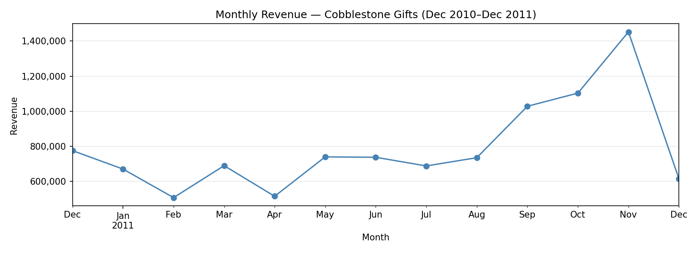
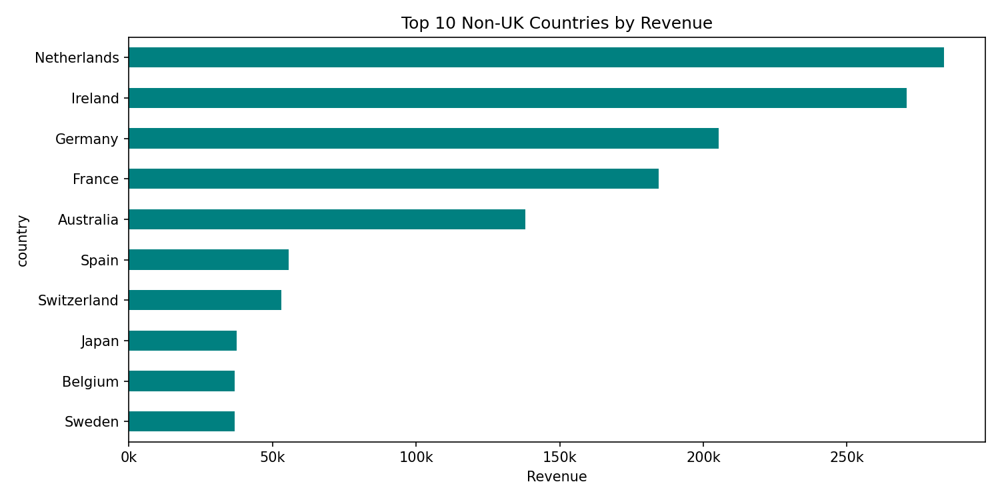

## Q1 · Seasonality

Total revenue for the period was just over £9M. Revenue climbs from late
summer and peaks in **November 2011**, roughly double the average non-peak
month. Inventory and fulfilment capacity need to be scaled up from October.

---

## Q2 · Best Sellers

The two top-10 lists have little overlap. Revenue leaders are higher-priced
gift sets bought in moderate quantities and unit leaders are inexpensive
small items (bags, cards, decorations) bought in bulk. The business has two
distinct demand patterns: premium gifting and high-volume cheap goods which
require separate pricing and stocking strategies.

---

## Q3 · Markets

Germany, France, and the Netherlands are the top three non-UK markets and
Western Europe as a region is by far the most valuable. The Netherlands has
notably high revenue relative to its customer count, suggesting wholesale
buyers. For expansion, Germany offers the best mix of revenue and customer
base breadth.

---

## Q4 · Customer Concentration

Yes, this is a wholesale-driven business. The top 1% of identifiable
customers account for a disproportionately large revenue share, and the
single largest customer dwarfs the rest.

---

## Q5 · Order Value

Non-UK customers place orders that are materially larger on average than UK
customers. UK buyers are likely a mix of small businesses and individual
shoppers with smaller basket sizes.

---

## Q6 · Returns & Cancellations

Cancellations represent around 2% of transactions. The most-cancelled
products overlap heavily with best-sellers. A small cluster of customers
generates a disproportionate share of cancelled revenue, likely
over-ordering then returning, which is worth flagging to the commercial
team.

---

## Q7 · Data-Quality Memo

**What was removed vs repaired:**

About 3.6% of raw rows were removed. The individual issue counts add up to
more than 19,408 because a lot of rows had multiple problems at once — like
a cancellation that also had a negative quantity, so it gets caught by both
filters. The biggest chunk removed was non-positive quantities, then
cancellations. The large chunk of duplicate rows were a bit surprising.

The rows with no CustomerID weren't dropped — they still have valid product,
country, and price data so we kept them and filled with 'UNKNOWN'. They just
get excluded when doing customer-specific analysis.

**Assumptions:**

1. InvoiceNo starting with 'C' = cancellation, not a sale.
2. StockCodes like POST, DOT, AMAZONFEE are admin/fee lines, not products.
3. Quantity <= 0 or UnitPrice <= 0 are errors or returns, not deliberate zero-price promotions.
4. Rows with no CustomerID are still real sales — the ID just wasn't captured, probably guest checkouts or wholesale buyers paying offline.
5. 'EIRE' and 'RSA' are just non-standard names for Ireland and South Africa.
6. Exact duplicate rows are an ETL artifact, not the same transaction legitimately recorded twice.

**Would we trust this for a board report?**

Kind of, depends on what's being reported.

Revenue totals, monthly trends, and product rankings are fine. The cleaning
was conservative and those numbers aren't sensitive to the CustomerID
problem. We'd be comfortable putting those in front of a board.

The duplicate rows also concern us a bit as they point to something broken
in the upstream export process. Until that's fixed, every future dataset
will need the same cleaning, and there's a risk that some duplicates differ
by just a timestamp and wouldn't be caught by drop_duplicates().

One more thing — this is only 13 months of data. That's not really enough
to confidently call the November spike a seasonal pattern vs a one-off.
You'd want at least 2-3 years to be sure.

**Short answer:** revenue and product numbers are board-ready with a quick
methodology note. Customer KPIs need a caveat until the CustomerID capture
rate is fixed at source.
